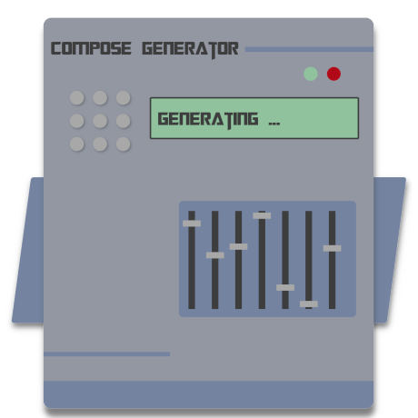

<p align="center">
  
  <h3 align="center">Compose Generator</h3>
  <p align="center">Easy to use cli to generate Docker Compose YAML configuration files.</p>
  <p align="center">
    <a target="_blank" href="https://github.com/compose-generator/compose-generator/releases/latest"></a>
    <a target="_blank" href="https://hub.docker.com/r/chillibits/compose-generator"></a>
    <a target="_blank" href="./.github/workflows/ci.yml"></a>
    <a target="_blank" href="./.github/workflows/codeql-analysis.yml"></a>
    <a target="_blank" href="https://goreportcard.com/report/github.com/compose-generator/compose-generator"></a>
    <a target="_blank" href="https://makeapullrequest.com"></a>
    <a target="_blank" href="./LICENSE.md"></a>
  </p>
</p>

---

## Documentation
Please visit the documentation on [https://compose-generator.com](https://www.compose-generator.com).

## Usage
You can use the Compose Generator CLI by directly installing it on your Docker host system or by generating your compose file with the Compose Generator Docker container.

### Install Compose Generator CLI
<details><summary><b>Install on Debian / Ubuntu / Raspbian</b></summary>
<p>

### Install
```sh
$ sudo apt-get update
$ sudo apt-get install apt-transport-https ca-certificates curl \
    gnupg-agent software-properties-common lsb-release
$ curl -fsSL https://repo.chillibits.com/artifactory/debian/gpg | \
    sudo apt-key add -
$ sudo add-apt-repository "deb https://repo.chillibits.com/artifactory/debian \
    $(lsb_release -cs) main"
$ sudo sudo apt-get update
$ sudo apt-get install compose-generator
```
### Use
```sh
$ compose-generator
```

</p>
</details>

<details><summary><b>Install on Fedora</b></summary>
<p>

### Install
```sh
$ sudo dnf -y install dnf-plugins-core
$ sudo dnf config-manager --add-repo \
    https://repo.chillibits.com/artifactory/rpm/chillibits.repo
$ sudo dnf install compose-generator
```
### Use
```sh
$ compose-generator
```

</p>
</details>

<details><summary><b>Install on CentOS</b></summary>
<p>

### Install
```sh
$ sudo yum install -y yum-utils
$ sudo yum-config-manager --add-repo \
    https://repo.chillibits.com/artifactory/rpm/chillibits.repo
$ sudo yum install compose-generator
```
### Use
```sh
$ compose-generator
```

</p>
</details>

<details><summary><b>Install on Alpine</b></summary>
<p>

### Install
```sh
$ apk update
$ sh -c "echo 'https://repo.chillibits.com/artifactory/alpine/$(cat \
    /etc/os-release | grep VERSION_ID | cut -d "=" -f2 | cut -d "." \
    -f1,2)/main'" >> /etc/apk/repositories
$ wget -O /etc/apk/keys/alpine.rsa.pub \
    https://repo.chillibits.com/artifactory/alpine/alpine.rsa.pub
$ apk add compose-generator
```
If there occure any errors on the last step, please try the following instead
```sh
$ apk add compose-generator --allow-untrusted
```
### Use
```sh
$ compose-generator
```

</p>
</details>

<details><summary><b>Windows</b></summary>
<p>

### Install
Compose Generator gets distributed for Windows via the new Windows package manager called [winget](https://github.com/microsoft/winget-cli). In the future, winget will be available for download in the Microsoft Store. Currently, the easiest way to install winget is, to download it manually from GitHub. Visit the [installation instruction](https://github.com/microsoft/winget-cli#installing-the-client) from Microsoft. <br>
As soon as the Windows package manager is installed on your Windows machine, you can open powershell and execute this installation command: <br>
```sh
$ winget install ChilliBits.ComposeGenerator
```
After installing Compose Generator, you should restart your powershell instance to make it reload the available commands.
### Use
```sh
$ compose-generator
```
    
</p>
</details>

## QuickStart with Docker
*Note for Windows users: This command does not work with Windows CMD command line. Please use Windows PowerShell instead.*

```sh
$ docker run --rm -it -v ${pwd}:/compose-generator/out chillibits/compose-generator
```

## Supported host systems & file downloads
There are also downloadable packages available for all supported platforms:

| **Platform**                | **x86_64 / amd64**                                                                     | **i386**                                                                             | **armv5**                                                                              | **armv6**                                                                              | **armv7**                                                                              | **arm64**                                                                              |
|-----------------------------|----------------------------------------------------------------------------------------|--------------------------------------------------------------------------------------|----------------------------------------------------------------------------------------|----------------------------------------------------------------------------------------|----------------------------------------------------------------------------------------|----------------------------------------------------------------------------------------|
| **Darwin / MacOS (tar.gz)** | [download](../../releases/download/0.3.0/compose-generator_0.3.0_darwin_amd64.tar.gz)  | -                                                                                    | -                                                                                      | -                                                                                      | -                                                                                      | -                                                                                      |
| **FreeBSD (tag.gz)**        | [download](../../releases/download/0.3.0/compose-generator_0.3.0_freebsd_amd64.tar.gz) | [download](../../releases/download/0.3.0/compose-generator_0.3.0_freebsd_386.tar.gz) | [download](../../releases/download/0.3.0/compose-generator_0.3.0_freebsd_armv5.tar.gz) | [download](../../releases/download/0.3.0/compose-generator_0.3.0_freebsd_armv6.tar.gz) | [download](../../releases/download/0.3.0/compose-generator_0.3.0_freebsd_armv7.tar.gz) | [download](../../releases/download/0.3.0/compose-generator_0.3.0_freebsd_arm64.tar.gz) |
| **Alpine (apk)**            | [download](../../releases/download/0.3.0/compose-generator_0.3.0_linux_amd64.apk)      | [download](../../releases/download/0.3.0/compose-generator_0.3.0_linux_386.apk)      | [download](../../releases/download/0.3.0/compose-generator_0.3.0_linux_armv5.apk)      | [download](../../releases/download/0.3.0/compose-generator_0.3.0_linux_armv6.apk)      | [download](../../releases/download/0.3.0/compose-generator_0.3.0_linux_armv7.apk)      | [download](../../releases/download/0.3.0/compose-generator_0.3.0_linux_arm64.apk)      |
| **CentOS (rpm)**            | [download](../../releases/download/0.3.0/compose-generator_0.3.0_linux_amd64.rpm)      | [download](../../releases/download/0.3.0/compose-generator_0.3.0_linux_386.rpm)      | [download](../../releases/download/0.3.0/compose-generator_0.3.0_linux_armv5.rpm)      | [download](../../releases/download/0.3.0/compose-generator_0.3.0_linux_armv6.rpm)      | [download](../../releases/download/0.3.0/compose-generator_0.3.0_linux_armv7.rpm)      | [download](../../releases/download/0.3.0/compose-generator_0.3.0_linux_arm64.rpm)      |
| **Debian (deb)**            | [download](../../releases/download/0.3.0/compose-generator_0.3.0_linux_amd64.deb)      | [download](../../releases/download/0.3.0/compose-generator_0.3.0_linux_386.deb)      | [download](../../releases/download/0.3.0/compose-generator_0.3.0_linux_armv5.deb)      | [download](../../releases/download/0.3.0/compose-generator_0.3.0_linux_armv6.deb)      | [download](../../releases/download/0.3.0/compose-generator_0.3.0_linux_armv7.deb)      | [download](../../releases/download/0.3.0/compose-generator_0.3.0_linux_arm64.deb)      |
| **Fedora (rpm)**            | [download](../../releases/download/0.3.0/compose-generator_0.3.0_linux_amd64.rpm)      | [download](../../releases/download/0.3.0/compose-generator_0.3.0_linux_386.rpm)      | [download](../../releases/download/0.3.0/compose-generator_0.3.0_linux_armv5.rpm)      | [download](../../releases/download/0.3.0/compose-generator_0.3.0_linux_armv6.rpm)      | [download](../../releases/download/0.3.0/compose-generator_0.3.0_linux_armv7.rpm)      | [download](../../releases/download/0.3.0/compose-generator_0.3.0_linux_arm64.rpm)      |
| **Raspbian (deb)**          | [download](../../releases/download/0.3.0/compose-generator_0.3.0_linux_amd64.deb)      | [download](../../releases/download/0.3.0/compose-generator_0.3.0_linux_386.deb)      | -                                                                                      | [download](../../releases/download/0.3.0/compose-generator_0.3.0_linux_armv6.deb)      | [download](../../releases/download/0.3.0/compose-generator_0.3.0_linux_armv7.deb)      | [download](../../releases/download/0.3.0/compose-generator_0.3.0_linux_arm64.deb)      |
| **Ubuntu (deb)**            | [download](../../releases/download/0.3.0/compose-generator_0.3.0_linux_amd64.deb)      | [download](../../releases/download/0.3.0/compose-generator_0.3.0_linux_386.deb)      | [download](../../releases/download/0.3.0/compose-generator_0.3.0_linux_armv5.deb)      | [download](../../releases/download/0.3.0/compose-generator_0.3.0_linux_armv6.deb)      | [download](../../releases/download/0.3.0/compose-generator_0.3.0_linux_armv7.deb)      | [download](../../releases/download/0.3.0/compose-generator_0.3.0_linux_arm64.deb)      |
| **Windows Installer (exe)** | [download](../../releases/download/0.3.0/ComposeGenerator_0.3.0_x64_Setup.exe)         | [download](../../releases/download/0.3.0/ComposeGenerator_0.3.0_x86_Setup.exe)       | -                                                                                      | -                                                                                      | -                                                                                      | -                                                                                      |
| **Windows Portable (zip)**  | [download](../../releases/download/0.3.0/compose-generator_0.3.0_windows_amd64.zip)    | [download](../../releases/download/0.3.0/compose-generator_0.3.0_windows_386.zip)    | -                                                                                      | -                                                                                      | -                                                                                      | -                                                                                      |

## Contribute by providing predefined templates
If you miss a predefined template and you want to create one for the public, please read the [instructions to create one](./predefined-templates/README.md). Fork the repository, create the template and open a pr.
The community is thankful for every predefined template!

## Contribute otherwise to the project
If you want to contribute to this project, please ensure you comply with the [contribution guidelines](CONTRIBUTING.md).

© Marc Auberer 2021