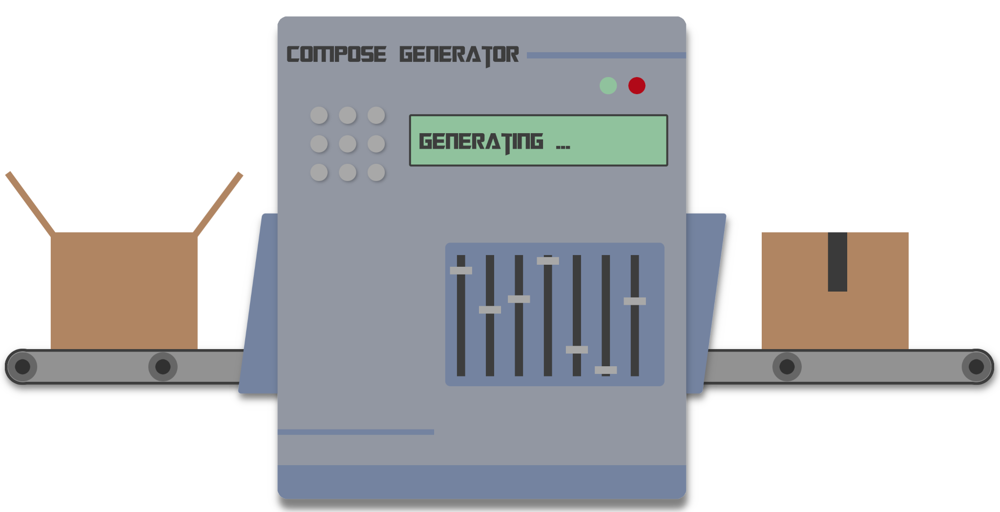

<p align="center">
  
  <h3 align="center">Compose Generator</h3>
  <p align="center">Easy to use cli tool to generate Docker Compose configurations blazingly fast.</p>
  <p align="center">
    <a target="_blank" href="https://github.com/compose-generator/compose-generator/releases/latest"></a>
    <a target="_blank" href="https://hub.docker.com/r/chillibits/compose-generator"></a>
    <a target="_blank" href="https://github.com/compose-generator/compose-generator/actions/workflows/test.yml"></a>
    <a target="_blank" href="https://github.com/compose-generator/compose-generator/actions/workflows/codeql-analysis.yml"></a>
    <a target="_blank" href="https://goreportcard.com/report/github.com/compose-generator/compose-generator"></a>
    <a href="https://codecov.io/gh/compose-generator/compose-generator"></a>
    <a target="_blank" href="https://makeapullrequest.com"></a>
    <a target="_blank" href="./LICENSE"></a>
  </p>
</p>

---

## Documentation
**Please visit the documentation on [compose-generator.com](https://www.compose-generator.com).**

### Install Compose Generator
To install Compose Generator on your system, please visit the [installation section](https://www.compose-generator.com/install/linux/) in the documentation. Compose Generator is available for the latest versions of Alpine, CentOS, Debian, Fedora, Raspbian, Ubuntu and Windows. If you want to install Compose Generator manually by downloading a package file, please take a look at the table below.

After installing, you can use Compose Generator in the terminal like this:
```sh
$ compose-generator [<command>]
```

## QuickStart with Docker
**For Linux:**
```sh
$ docker run --rm -it -v /var/run/docker.sock:/var/run/docker.sock -v $(pwd):/cg/out chillibits/compose-generator [<command>]
```

**For Windows:**
```sh
$ docker run --rm -it -v /var/run/docker.sock:/var/run/docker.sock -v ${pwd}:/cg/out chillibits/compose-generator [<command>]
```
*Note: This command does not work with Windows CMD command line. Please use Windows PowerShell instead.*

## Supported host systems & file downloads
There are downloadable packages available for all supported platforms:

| **Platform**                | **x86_64 / amd64**                                                                                                                | **i386**                                                                                                                      | **armv5**                                                                                                               | **armv6**                                                                                                               | **armv7**                                                                                                               | **arm64**                                                                                                               |
|-----------------------------|-----------------------------------------------------------------------------------------------------------------------------------|-------------------------------------------------------------------------------------------------------------------------------|-------------------------------------------------------------------------------------------------------------------------|-------------------------------------------------------------------------------------------------------------------------|-------------------------------------------------------------------------------------------------------------------------|-------------------------------------------------------------------------------------------------------------------------|
| **Darwin / MacOS (tar.gz)** | [download](https://github.com/compose-generator/compose-generator/releases/latest/download/compose-generator_darwin_amd64.tar.gz) | -                                                                                                                             | -                                                                                                                       | -                                                                                                                       | -                                                                                                                       | -                                                                                                                       |
| **Alpine (apk)**            | [download](https://github.com/compose-generator/compose-generator/releases/latest/download/compose-generator_amd64.apk)           | [download](https://github.com/compose-generator/compose-generator/releases/latest/download/compose-generator_386.apk)         | [download](https://github.com/compose-generator/compose-generator/releases/latest/download/compose-generator_armv5.apk) | [download](https://github.com/compose-generator/compose-generator/releases/latest/download/compose-generator_armv6.apk) | [download](https://github.com/compose-generator/compose-generator/releases/latest/download/compose-generator_armv7.apk) | [download](https://github.com/compose-generator/compose-generator/releases/latest/download/compose-generator_arm64.apk) |
| **CentOS (rpm)**            | [download](https://github.com/compose-generator/compose-generator/releases/latest/download/compose-generator_amd64.rpm)           | [download](https://github.com/compose-generator/compose-generator/releases/latest/download/compose-generator_386.rpm)         | [download](https://github.com/compose-generator/compose-generator/releases/latest/download/compose-generator_armv5.rpm) | [download](https://github.com/compose-generator/compose-generator/releases/latest/download/compose-generator_armv6.rpm) | [download](https://github.com/compose-generator/compose-generator/releases/latest/download/compose-generator_armv7.rpm) | [download](https://github.com/compose-generator/compose-generator/releases/latest/download/compose-generator_arm64.rpm) |
| **Debian (deb)**            | [download](https://github.com/compose-generator/compose-generator/releases/latest/download/compose-generator_amd64.deb)           | [download](https://github.com/compose-generator/compose-generator/releases/latest/download/compose-generator_386.deb)         | [download](https://github.com/compose-generator/compose-generator/releases/latest/download/compose-generator_armv5.deb) | [download](https://github.com/compose-generator/compose-generator/releases/latest/download/compose-generator_armv6.deb) | [download](https://github.com/compose-generator/compose-generator/releases/latest/download/compose-generator_armv7.deb) | [download](https://github.com/compose-generator/compose-generator/releases/latest/download/compose-generator_arm64.deb) |
| **Fedora (rpm)**            | [download](https://github.com/compose-generator/compose-generator/releases/latest/download/compose-generator_amd64.rpm)           | [download](https://github.com/compose-generator/compose-generator/releases/latest/download/compose-generator_386.rpm)         | [download](https://github.com/compose-generator/compose-generator/releases/latest/download/compose-generator_armv5.rpm) | [download](https://github.com/compose-generator/compose-generator/releases/latest/download/compose-generator_armv6.rpm) | [download](https://github.com/compose-generator/compose-generator/releases/latest/download/compose-generator_armv7.rpm) | [download](https://github.com/compose-generator/compose-generator/releases/latest/download/compose-generator_arm64.rpm) |
| **Raspbian (deb)**          | [download](https://github.com/compose-generator/compose-generator/releases/latest/download/compose-generator_amd64.deb)           | [download](https://github.com/compose-generator/compose-generator/releases/latest/download/compose-generator_386.deb)         | -                                                                                                                       | [download](https://github.com/compose-generator/compose-generator/releases/latest/download/compose-generator_armv6.deb) | [download](https://github.com/compose-generator/compose-generator/releases/latest/download/compose-generator_armv7.deb) | [download](https://github.com/compose-generator/compose-generator/releases/latest/download/compose-generator_arm64.deb) |
| **Ubuntu (deb)**            | [download](https://github.com/compose-generator/compose-generator/releases/latest/download/compose-generator_amd64.deb)           | [download](https://github.com/compose-generator/compose-generator/releases/latest/download/compose-generator_386.deb)         | [download](https://github.com/compose-generator/compose-generator/releases/latest/download/compose-generator_armv5.deb) | [download](https://github.com/compose-generator/compose-generator/releases/latest/download/compose-generator_armv6.deb) | [download](https://github.com/compose-generator/compose-generator/releases/latest/download/compose-generator_armv7.deb) | [download](https://github.com/compose-generator/compose-generator/releases/latest/download/compose-generator_arm64.deb) |
| **Windows Installer (msi)** | [download](https://github.com/compose-generator/compose-generator/releases/latest/download/compose-generator_x64_setup.msi)       | [download](https://github.com/compose-generator/compose-generator/releases/latest/download/compose-generator_x86_setup.msi)   | -                                                                                                                       | -                                                                                                                       | -                                                                                                                       | -                                                                                                                       |
| **Windows Portable (zip)**  | [download](https://github.com/compose-generator/compose-generator/releases/latest/download/compose-generator_windows_amd64.zip)   | [download](https://github.com/compose-generator/compose-generator/releases/latest/download/compose-generator_windows_386.zip) | -                                                                                                                       | -                                                                                                                       | -                                                                                                                       | -                                                                                                                       |

## Contribute by providing predefined templates
If you miss a predefined template and you want to create one for the public, please read the [instructions to create one](./predefined-services/README.md). Fork the repository, create the template and open a pr to the latest `release/v...` branch.
The community is thankful for every predefined template!

## Contribute otherwise to the project
If you want to contribute to this project, please ensure you comply with the [contribution guidelines](CONTRIBUTING.md).

© Marc Auberer 2021
